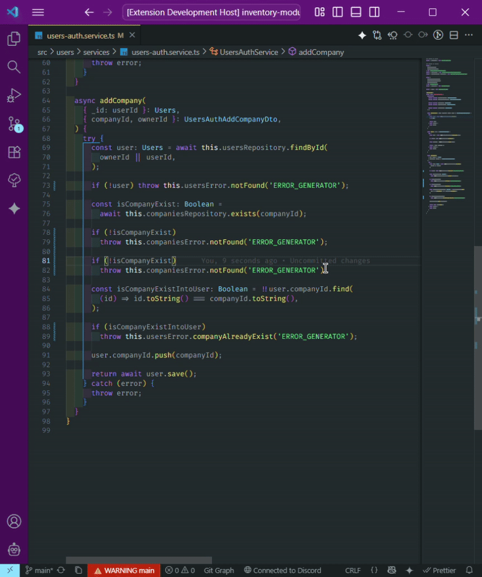
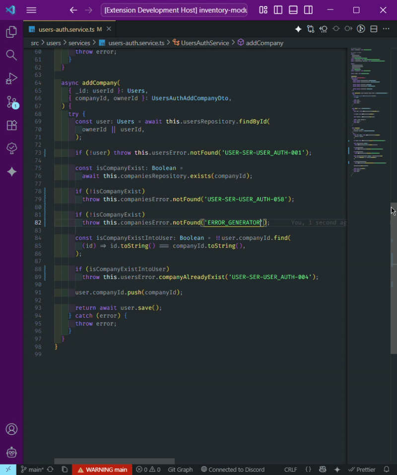
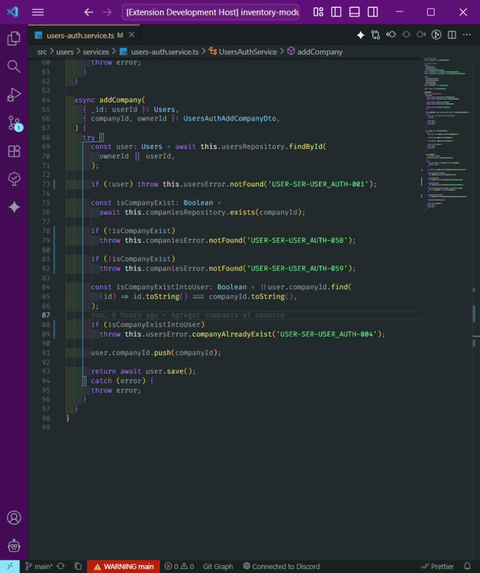

# Error codes generator - VS Code Extension

## Description

`Error codes generator` is a powerful VS Code extension designed to streamline your development workflow by providing tools for generating, formatting, and managing error codes and nomenclatures directly within your editor. This extension helps maintain consistency and clarity in your codebase, especially in large projects.

## Features

- **Generate Error Codes:** Automatically create unique and standardized error codes.
- **Format Error Codes:** Ensure all error codes in your project adhere to a consistent format.
- **Snippet for Error Generator:** Use the `erg` snippet to quickly insert the `"ERROR_GENERATOR"` keyword.

## Usage

To generate an error code, you can use the `erg` snippet to insert the `"ERROR_GENERATOR"` keyword, or manually type it. The extension will automatically replace the keyword with a generated nomenclature.

The error code is created based on the file path, with an incremental counter for each error in the file. For example, for a file located at `src/core/utils.ts`, the generated codes would be:

- `SRC_CORE_UTILS_001`
- `SRC_CORE_UTILS_002`

## Demonstration

As long as there are no codes, using the key ‘ERROR_GENERATOR’ with the command <Generate error codes> generates codes for all established positions.

If there is already a counter in the file, the last counter is analyzed to continue the sequence.

Using the <Format error codes> command analyzes all the keys already established to restart the counter from th

## Commands

This extension provides the following commands, which can be accessed via the Command Palette (`Ctrl+Shift+P` or `Cmd+Shift+P` on Mac):

- `Web Coding Solution: Generate Error Codes`
- `Web Coding Solution: Format Error Codes`

## Installation

1.  Open Visual Studio Code.
2.  Go to the Extensions view (`Ctrl+Shift+X` or `Cmd+Shift+X`).
3.  Search for "Error codes generator".
4.  Click "Install".

Alternatively, you can find it on the [VS Code Marketplace](https://marketplace.visualstudio.com/).

## Development

To get started with developing this extension locally:

### Prerequisites

- [Node.js](https://nodejs.org/) (includes npm)
- [Visual Studio Code](https://code.visualstudio.com/)
